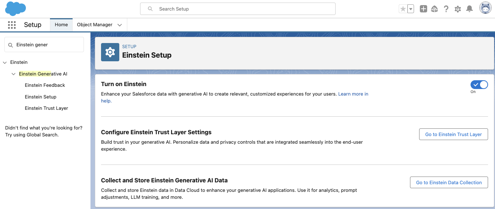

**Introduction**

This guide will help you create two custom Agent actions to retrieve order status from a third-party order tracking system and retrieve any vouchers available to the person who placed the order.


If you want to learn more about Generative AI features in Salesforce visit: https://help.salesforce.com/s/articleView?id=sf.generative_ai.htm&type=5

**PART I - Configure Agent Studio**

#### **Step 1. Turn on Einstein** 

* From the **Setup ⚙️,** click on **Setup**
* In the quick find, search for **Einstein Generative AI** and select **Einstein Setup**
* Switch the **Turn on Einstein** toggle to active


#### **Step 2. Enable Agent Studio**

* From the **Setup ⚙️,** click on **Setup**
* In the quick find, search for **Agents** and click on it
* Activate the **Einstein Copilot** toggle to **on**
 
* Confirm that the Agent load by clicking into the **Agent** that gets created automatically and clicking on Open in Builder
 

#### **Step 3. Create your mock tracking API**

* Create an account at https://mockapi.io/projects
* Create a new Project
* Within the project, create a new resource
* Make sure that your new resource looks like this:
  
* Click on the Data button and complete the JSON collection based on your structure. 
    * **Important:** Make sure that you are using email address of contacts that exists in your org so the solution will find some matches!
    * Here’s an example on how your data should look like:
    ```[{"status":"shipped","emailaddress":"mlexington@example.com","id":"1234"},{"status":"cancelled","emailaddress":"lbailey@example.com","id":"5512"},{"status":"created","emailaddress":"amiller@example.com","id":"5544"},{"status":"shipped","emailaddress":"psanders@example.com","id":"5555"},{"status":"shipped","emailaddress":"asahnd@example.com","id":"5589"}]```
* Explore the collection to make sure it returns values, do this by opening a new browser and exploring: [https://[your endpoint]mockapi.io/api/v1/trackings/1234](https://66b60bc5b5ae2d11eb65b38e.mockapi.io/api/v1/trackings/1234)

#### **Step 4.  Authorize your tracking API**

* Go to setup → search for Remote site Settings
* Click on new Remote site
* Remote site name:Tracker
* URL: [https://[your endpoint].mockapi.io](https://66b60bc5b5ae2d11eb65b38e.mockapi.io/api/v1/trackings/1234)
* Click Save


**PART II - Extend Agent Studio with Custom Actions**

**Step 1. Create Get Vouchers for Agent Flow**

* From the **Setup ⚙️**, use Quick Find to open **Flows**
* Click **New Flow**
* Select **Start From Scratch**
* Click **Next**
* Select **Autolaunched Flow (No Trigger)** 

* Click **Create**
* Open the **Resources** panel, by clicking on this icon on the left area of the page:
* Click **New Resource**
* Create the following **Variable** resources

|Option	|Value	|
|---	|---	|
|Resource Type	|Variable	|
|API Name	|EmailAddress	|
|Description	|-leave blank-	|
|Data Type	|Text	|
|Allow multiple values (collection)	|-leave unchecked-	|
|Default Value	|-leave blank-	|
|Availability Outside the Flow	|Available for **input**	|

|Option	|Value	|
|---	|---	|
|Resource Type	|Variable	|
|API Name	|ContactID	|
|Description	|-leave blank-	|
|Data Type	|Text	|
|Allow multiple values (collection)	|-leave unchecked-	|
|Default Value	|-leave blank-	|
|Availability Outside the Flow	|-none-	|

|Option	|Value	|
|---	|---	|
|Resource Type	|Variable	|
|API Name	|LoyaltyMemberProgramID	|
|Description	|-leave blank-	|
|Data Type	|Text	|
|Allow multiple values (collection)	|-leave unchecked-	|
|Default Value	|-leave blank-	|
|Availability Outside the Flow	|-none-	|

|Option	|Value	|
|---	|---	|
|Resource Type	|Variable	|
|API Name	|VoucherCode	|
|Description	|-leave blank-	|
|Data Type	|Text	|
|Allow multiple values (collection)	|-leave unchecked-	|
|Default Value	|-leave blank-	|
|Availability Outside the Flow	|Available for Output	|

|Option	|Value	|
|---	|---	|
|Resource Type	|Variable	|
|API Name	|ExpirationDate	|
|Description	|-leave blank-	|
|Data Type	|Date	|
|Allow multiple values (collection)	|-leave unchecked-	|
|Default Value	|-leave blank-	|
|Availability Outside the Flow	|Available for Output	|

|Option	|Value	|
|---	|---	|
|Resource Type	|Variable	|
|API Name	|DiscountPercent	|
|Description	|-leave blank-	|
|Data Type	|Number	|
|Allow multiple values (collection)	|-leave unchecked-	|
|Default Value	|-leave blank-	|
|Availability Outside the Flow	|Available for Output	|

* Click **Save**
* Set the **Flow Label** to **Get Vouchers for Agent**
* Click **Save**
* Click the + between the start and end steps
* Scroll down and click on **Get Records**
* Configure the screen with the following settings.

|Option	|Value	|	|	|
|---	|---	|---	|---	|
|Label	|Get Contact	|	|	|
|API Name	|-auto generated-	|	|	|
|Description	|-leave blank-	|	|	|
|Data Source	|Salesforce Object	|	|	|
|Object	|Contact	|	|	|
|Condition Requirements	|All Conditions are Met (AND)	|	|	|
|Field	|Email Equals EmailAddress	|	|	|
|Sort Order	|Not Sorted	|	|	|
|How Many Records to Store	|Only the first record	|	|	|
|How to Store Record Data	|Choose fields and assign variables (advanced)	|	|	|
|Where to Store Field Values	|In separate variables	|	|	|
|Select Variables to Store Fields	|	|	|	|
|	|Id	|→	|ContactId	|


* Click **Save**

Add another Get records action to your flow looking like this:


|Option	|Value	|	|	|
|---	|---	|---	|---	|
|Label	|Get Loyalty Program Member	|	|	|
|API Name	|-auto generated-	|	|	|
|Description	|-leave blank-	|	|	|
|Data Source	|Salesforce Object	|	|	|
|Object	|Loyalty Program Member	|	|	|
|Condition Requirements	|All Conditions are Met (AND)	|	|	|
|Field	| ContactId Equals ContactId	|	|	|
|Sort Order	|Not Sorted	|	|	|
|How Many Records to Store	|Only the first record	|	|	|
|How to Store Record Data	|Choose fields and assign variables (advanced)	|	|	|
|Where to Store Field Values	|In separate variables	|	|	|
|Select Variables to Store Fields	|	|	|	|
|	|Id	|→	|LoyaltyMemberProgramID	|

Add one more Get records action to your flow:


|Option	|Value	|	|	|
|---	|---	|---	|---	|
|Label	|Get Voucher	|	|	|
|API Name	|-auto generated-	|	|	|
|Description	|-leave blank-	|	|	|
|Data Source	|Salesforce Object	|	|	|
|Object	|Voucher	|	|	|
|Condition Requirements	|All Conditions are Met (AND)	|	|	|
|Field	| LoyaltyProgramMemberId Equals LoyaltyMemberProgramID	|	|	|
|Sort Order	|Not Sorted	|	|	|
|How Many Records to Store	|Only the first record	|	|	|
|How to Store Record Data	|Choose fields and assign variables (advanced)	|	|	|
|Where to Store Field Values	|In separate variables	|	|	|
|Select Variables to Store Fields	|	|	|	|
|	|DiscountPercent	|→	|DiscountPercent	|
|	|ExpirationDate	|→	|ExpirationDate	|
|	|VoucherCode	|→	|VoucherCode	|


* Your final Flow should look like this:


* Click **Activate**
* Click the **back arrow button** to go back to setup


#### **Create a custom Copilot action that invokes the Flow**

* While still inside **Setup**, use **Quick Find** to navigate to **Agent Actions**
* Click **New Copilot Action**
* Configure the action as following:

|Option	|Value	|
|---	|---	|
|Reference Action Type	|Flow	|
|Reference Action	|Get Vouchers for Agent	|
|Copilot Action Label	|Get Vouchers for Agent	|

* Click **Next**

|Option	|Value	|
|---	|---	|
|Copilot Action Instructions	|Receive the email address of a contact and retrieves the voucher information for this contact. Provide discountPercent as a percentage, expirationDate as a date and vouchercode as a string. You must always call Get_Vouchers_for_Agent right after Agent_Get_Order_Status is called.	|

**Input**

|EmailAddress	|	|
|---	|---	|
|Option	|Value	|
|Instructions	|The email address as a result of fetching the status of an order.	|
|Require input	|not checked	|

**Outputs**

|Option	|Value	|
|---	|---	|
|DiscountPercent	|	|
|Instructions	|The discount percentage	|
|Show in conversation	|checked	|
|ExpirationDate	|	|
|Instructions	|The expiration date of the voucher	|
|Show in conversation	|checked	|
|VoucherCode	|	|
|Instructions	|The voucher code	|
|Show in conversation	|checked	|

* Click **Finish**

**Step 2. Create the Agent Get Order Status APEX Class**


* Click on the Gear Icon **⚙️,** click on **Developer Console**
* Click on **File - New - Apex Class**
* Name your file AgentGetOrderDetails
* Paste the code from the AgentGetOrderDetails.cls file located in this repository 
* **Important!** Make sure you replace the end point of your mock api in the code
* Click on **File - Save** and close the developer console

#### **Create a custom Copilot action that invokes the APEX Class**

* While still inside **Setup**, use **Quick Find** to navigate to **Agent Actions**
* Click **New Copilot Action**
* Configure the action as following:

|Option	|Value	|
|---	|---	|
|Reference Action Type	|Apex	|
|Reference Action	|Agent Get Order Status	|
|Copilot Action Label	|Agent Get Order Status	|

* Click **Next**

|Option	|Value	|
|---	|---	|
|Copilot Action Instructions	|This action connects to a third party tracking API to retrieve the status of an order given an order ID as an input. This action will provide the order status in the conversation window and should always call Get_Vouchers_for_Agent utilizing the emailaddress attribute from the response to retrieve voucher information for a given emailaddress.	|

**Input**
Leave as is

**Outputs**

|Option	|Value	|
|---	|---	|
|Output instructions	|	|
|Instructions	|Provide the status of the order in the conversation window. This action should always retrieve vouchers associated with the order calling Get_Vouchers_for_AgentStudio utilizing the emailaddress attribute from the response and retrieve the voucher information for this given email address. Provide the Voucher Code, the Expiration date formatted as a date and the Discount Percent as a percentage in the conversation window.	|
|Show in conversation	|checked	|

* Click **Finish**

#### **Step 3. Add the Actions to your Agent**

* From **Setup**, use **Quick Find** to navigate to **Agents**
* Click on your Agent
* Click **Open in Builder**
* Make sure your Agent is deactivated, if not click on **Deactivate** 
* Click on the Agent’s topic
* Scroll up and click on **This Agent’s Actions**
* Click on the Plus sign and search for our two new custom actions: Agent Get Order Status and Get Vouchers for Agent


* Click on **Finish**

**PART III - Let’s do some testing**

* Click **Activate** 
* Click on the Back Arrow and navigate to Service or Sales Console
* Click on the Einstein icon on the top navigation bar to open up the Agent Window
* In the conversation window, ask the Agent to provide you with the status of an order and provide an order number from your Mock API

